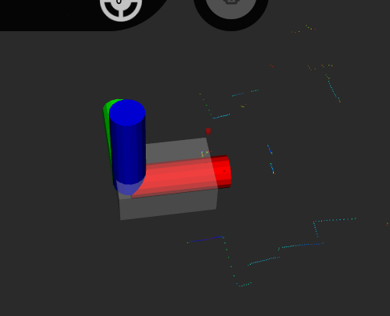
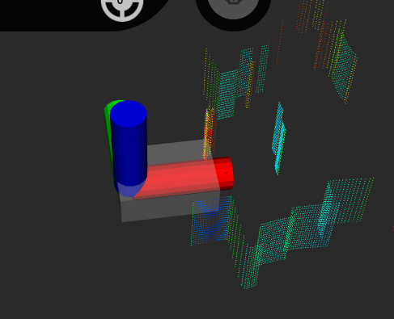
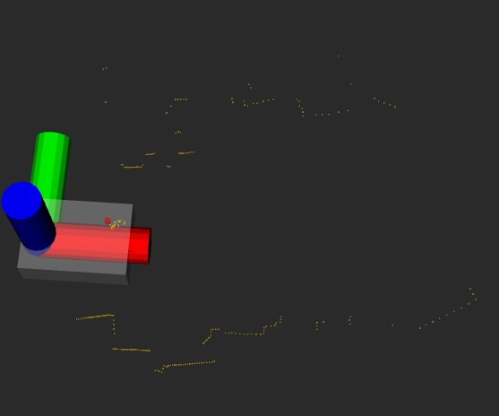
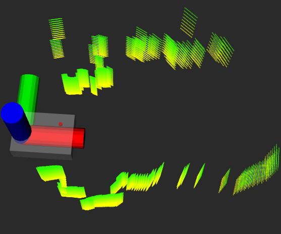

# pointcloud_augmentor

A ROS2 node to publish a point cloud topic based on the subscribed point cloud topic with extra points added according to the parameter-specified direction, pitch and length.

## Background

In a robot equipped with a 3D LiDAR and 2D LiDARs, the number of points in the image of objects only seen by 2D LiDARs can be significantly smaller compared to those also seen by 3D LiDAR, potentially leading to the non-detection of sucn objects in perception module of Autoware.

This node copies incoming point cloud along the specified direction. Typically by copying points vertically, image of objects becomes vertically larger, hopefully contributing a higher detection ratio of such hard-to-see objects.

## Parameters

See `config/params.yaml` as an example.

~~~
**:
  ros__parameters:
    direction:
      x:  0.0
      y:  0.0
      z: -1.0
    length: 1.0
    offset: 0.0
    pitch: 0.05
    horizontal_multiplier: 32
    proportional_augmentation: true
    horizontal_angular_pitch: 0.0031416
    vertical_angular_pitch: 0.0349
    center:
      x:  1.255
      y: -0.14
      z:  0.23
~~~~

- `direction`: Specify the direction vector along which points should be copied. Preferably specify a unit vector. Specifying all 0 means no copying operation will be done. The vector is interpreted in frame of the incoming point cloud.  
- `pitch`: Pitch of copying operation (unit: m)
- `offset`: Offset from which copying operation starts (unit: m)
- `length`: Length up to which copying operation will be done (unit: m)
- `horizontal_multiplier`: augment to the horizontal direction also; will trigger T-shaped augmentation (augmentation along x-axis and y-axis agumentation) when `proportional_augmentor` is `false`. T-shaped augmentatin seems to help autoware perception module to detect objects 
- `proportional_augmentor`: make augmentation pitches (both vertical and horizontal) proportional to distance from the center of lidar
- `center`: Center point of LiDAR
- `horizontal_angular_pitch`: Horizontal augmentation pitch [radian]
- `vertical_angular_pitch`: Vertical augmentation pitch [radian]

Note that all parameters support dynamic reconfiguration usually done by `rqt`.

## Example

### Launch 

For a quick testing, execute:

`ros2 launch pointcloud_augmentor aug_2dlidar_pcl.launch.xml`

### Result

#### Non-proportional augmentation

##### Original point cloud seen in rviz2

##### Augmented point cloud seen in rviz2

#### Proportional augmentation

##### Parameters:

~~~~

/**:
  ros__parameters:
    direction:
      x:  0.0
      y:  0.0
      z:  1.0
    length: 0.05
    offset: 0.0
    pitch:  0.01
    no_push_back: true
    horizontal_multiplier: 32
    proportional_augmentation: true
    horizontal_angular_pitch: 0.0031416
    vertical_angular_pitch: 0.0349
    center:
      x:  1.255
      y: -0.14
      z:  0.23

~~~~

##### Original point cloud seen in rviz2

##### Augmented point cloud seen in rviz2

### History

- 2024-08-20 created by H.Miyagi in FUTU-RE Co., Ltd
- 2024-09-16 added descreption on proportional augmentation

\[END OF DOCUMENT\]
